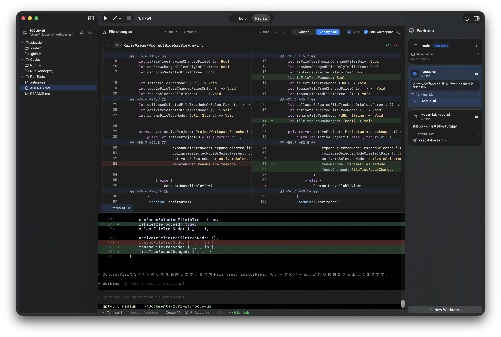

<p align="center">
  
</p>

<h1 align="center">Ruri</h1>

RuriはAI時代のためのコード**レビュー**エディタです。業務開発やAI Agentを用いた開発では、コードを書く以上にコードレビューの比重が大きくなります。
大きいプロジェクトでの軽快な動作・視認性の高い差分表示・エディタ/差分表示をまたいだシンボルジャンプ・Git worktreeを使ったAI Agentの並列稼働など、現代の開発に求められる機能を搭載しています。

重くなってしまうLSPサポートなどは意図的に実装されません。高レベルな開発作業は既存のIDEなどを利用されることを推奨します。

<p align="center">
  
</p>

## 機能

- ファイルツリー移動、リネーム、保存競合検出、検索、置換、プロジェクト全体のテキスト検索に対応したマルチタブエディタ。
- ブランチまたは作業ツリーをdiff baseにできる、Git連携サイドバーとReviewモード。
- 関連worktreeの作成、切り替え、pull、削除、メモを1つのウィンドウで扱うruri-style Git worktree管理。
- 開いているworkspaceごとに分離された統合ターミナルタブと、`.ruri/run-configurations.json` に保存される実行構成。
- 主要なJVM、Web、設定、マークアップ形式に対応したTree-sitterシンタックスハイライトとシンボル/使用箇所ナビゲーション。
- 認証とPull RequestコンテキストのためのGitHub CLI連携。外部URL scheme `ruri://github.com/{owner}/{repo}/pull/{number}` にも対応。

## 必要環境

- macOS Tahoe 26以降。
- Xcode 26以降。
- リポジトリとworktree操作用の `git`。
- 任意のGitHub認証とPull Request機能用の `gh`。

## インストール

Homebrewで最新の署名なしarm64 buildをインストールできます。

```sh
brew tap mizucoffee/ruri-editor https://github.com/mizucoffee/ruri-editor.git
brew install --cask mizucoffee/ruri-editor/ruri
```

このアプリは署名・Notarizationなしで配布されます。初回起動時にmacOSのGatekeeper確認が必要になる場合があります。

## 開発

Xcodeでプロジェクトを開きます。

```sh
open Ruri.xcodeproj
```

コマンドラインからビルドします。

```sh
xcodebuild -project Ruri.xcodeproj -scheme Ruri -destination platform=macOS -derivedDataPath /private/tmp/ruri-derived-data CODE_SIGNING_ALLOWED=NO CODE_SIGNING_REQUIRED=NO build
```

テストを実行します。

```sh
xcodebuild test -project Ruri.xcodeproj -scheme Ruri -destination platform=macOS -derivedDataPath /private/tmp/ruri-derived-data CODE_SIGNING_ALLOWED=NO CODE_SIGNING_REQUIRED=NO
```

Unit test targetは `RuriTests` で、アプリのmoduleは `ruri` としてimportします。Swift Package依存関係は `Ruri.xcodeproj/project.xcworkspace/xcshareddata/swiftpm/Package.resolved` で解決されます。

## 配布

`main` にpushされると、GitHub Actionsが署名なしのarm64 `Ruri.app` zipをビルドします。`homebrew-latest` releaseはHomebrew cask向けに毎回更新され、`v1.0.<run_number>` 形式のreleaseも作成されます。
